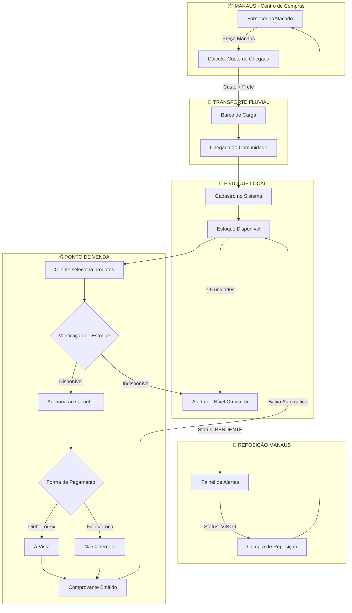
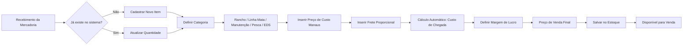
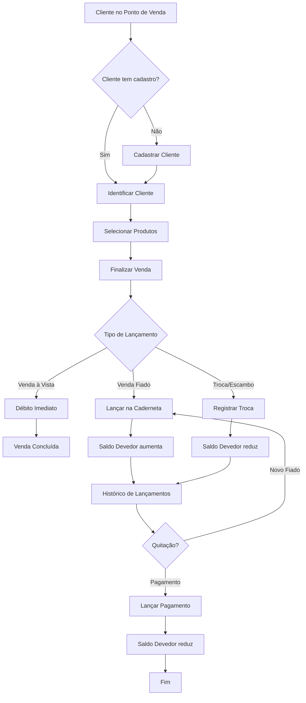
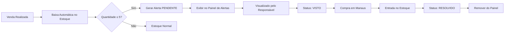
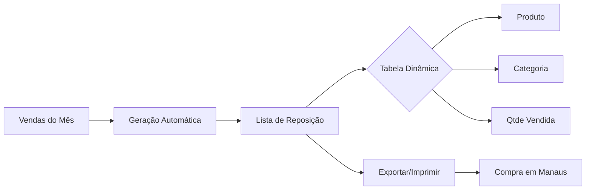
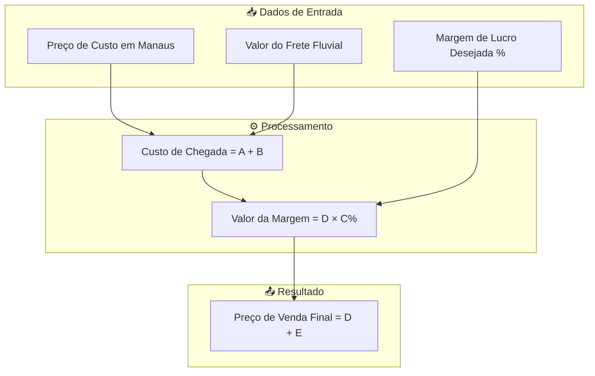
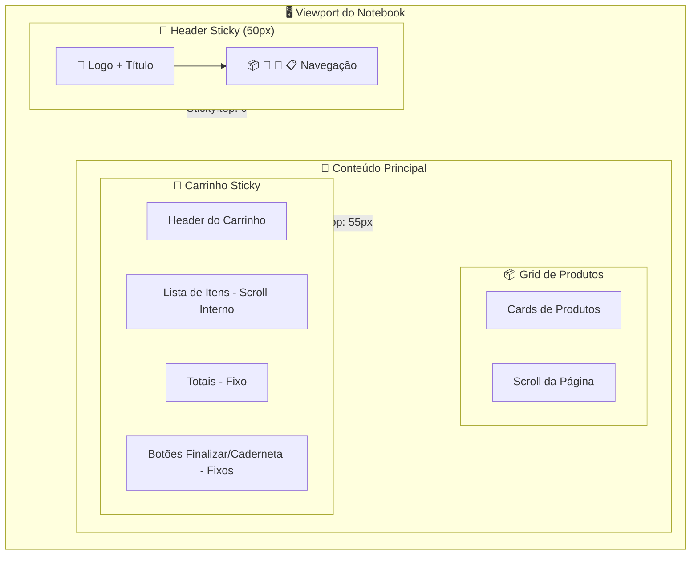
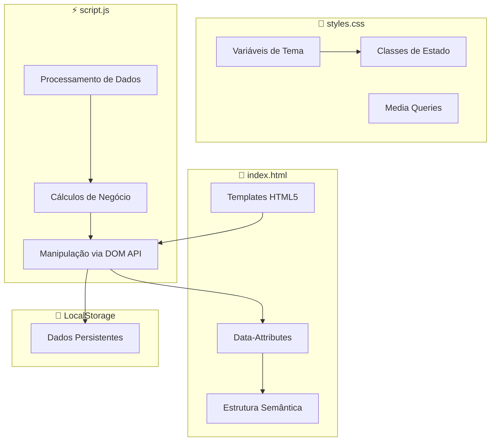
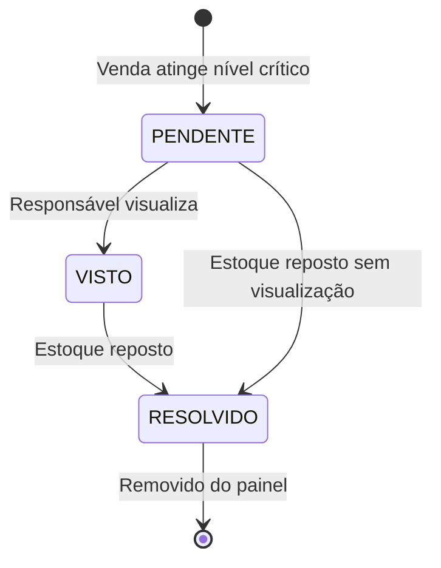
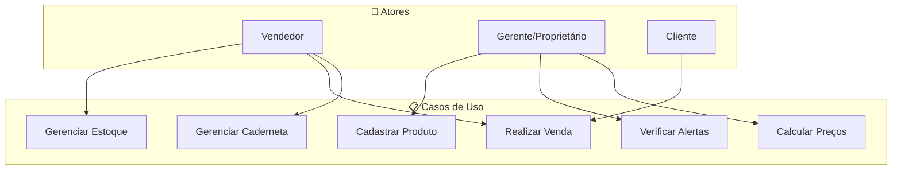

# 🌊 Fluxogramas - Flor do Luar

## 🔄 Fluxo Principal: Ciclo de Mercadorias



---

## 🏗️ Fluxo de Cadastro de Produto



---

## 💳 Fluxo da Caderneta de Crédito



---

## 🚨 Fluxo de Alertas de Estoque



---

## 📋 Fluxo do Módulo de Reposição



**Descrição:** Ferramenta de auxílio à logística para geração de listas de compras mensais baseadas em estoque baixo.

---

## 🧮 Fluxo de Cálculo de Preço (Precificação Interna)



---

## 🎨 Arquitetura UI/UX - Sticky Elements

### Estrutura de Layout



### Propriedades CSS Sticky

| Elemento | Position | Top | Z-Index | Altura |
|----------|----------|-----|---------|--------|
| **Header** | `sticky` | `0` | `1000` | ~50px |
| **Carrinho** | `sticky` | `55px` | - | `calc(100vh - 90px)` |

### Flexbox do Carrinho

```
┌─────────────────────┐
│ Header Carrinho     │  flex-shrink: 0
├─────────────────────┤
│                     │
│ Lista de Itens      │  flex: 1, overflow-y: auto
│ (Scroll Interno)    │
│                     │
├─────────────────────┤
│ Totais              │  flex-shrink: 0
├─────────────────────┤
│ Botões              │  flex-shrink: 0, margin-top: auto
└─────────────────────┘
```

---

## 🔄 Arquitetura do Sistema (SoC)



---

## 📊 Diagrama de Estados - Alerta de Estoque



---

## 🎯 Diagrama de Casos de Uso



---

**Fluxogramas Flor do Luar v1.0** 🌙
*Representação visual dos processos de logística fluvial amazônica*
